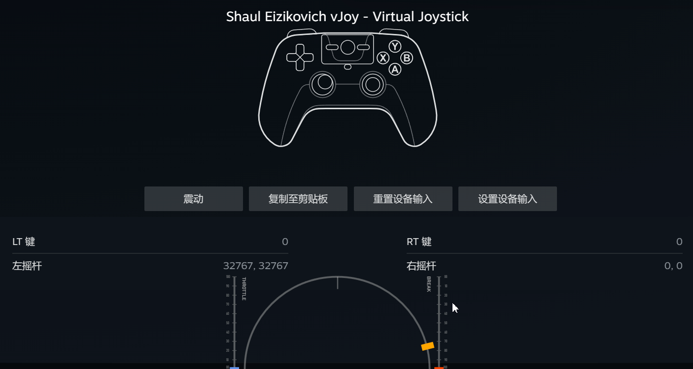
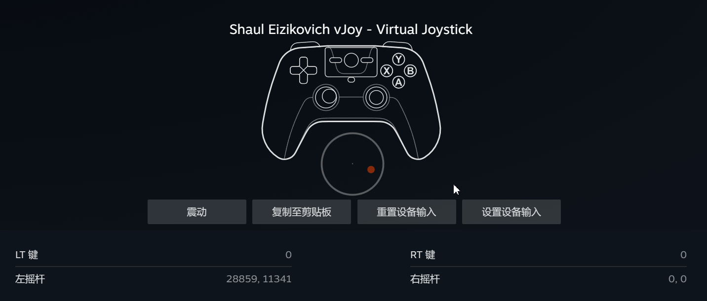
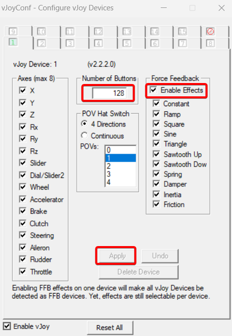
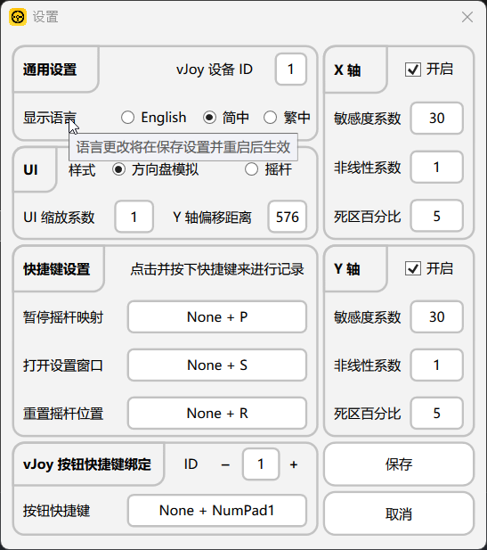
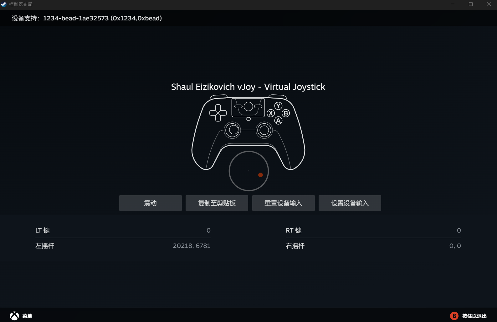

<h1 align="center">Mouse Steering Wheel</h1>
<p align="center">
    
</p>

<p align="center">
    <a href="https://github.com/Siriusq/MouseSteeringWheel/blob/master/README/README-CN.md"></a>
    
        
    
    
    
</p>

Mouse Steering Wheel is a vJoy Feeder program that transmits mouse movement events to [vJoy (virtual joystick)](https://github.com/shauleiz/vJoy). vJoy then converts the input signals into analog controller outputs, enabling the simulation of a steering wheel or joystick using a mouse.  

The program is built with the WPF framework and developed in C#. It supports only 64-bit Windows systems. For Windows versions earlier than Windows 10 1903, [.NET Framework 4.8](https://dotnet.microsoft.com/en-us/download/dotnet-framework/net48) must be installed separately to run the program.

# Features  
- Supports vJoy device switching  
- Supports up to 128 vJoy buttons, each assignable to a custom hotkey  
- Built-in UI themes: Steering Wheel Style and Joystick Style. When using the joystick style, the UI's position is adjustable  
- Supports UI scaling  
- Allows independent activation and configuration of X-axis / Y-axis joystick simulation  
- Adjustable joystick sensitivity  
- Supports nonlinear joystick configuration  
- Configurable joystick dead zone  
- Hotkey support for resetting the joystick and mouse position  
- Hotkey support for pausing input  
- Supports English, Simplified Chinese, and Traditional Chinese language switching

<div align=center>
    
    <p> Steering Wheel UI </p>
</div>

<div align=center>
    
    <p> Joystick UI </p>
</div>

# How to Use
## Install and Configure vJoy
1. Download and install [vJoy 2.2.2.0 version](https://github.com/BrunnerInnovation/vJoy).
2. Open the **Configure vJoy** program.
3. Set the **Number of Buttons** to 128.
4. It is recommended to enable **Force Feedback Effects**.
5. Click **Apply** to save the changes.

## Notes
1. After downloading, simply double-click **MouseSteeringWheel.exe** to run it, installation is NOT required.
2. Press the **S** key to open the settings window.
3. When you hover the mouse over the text preceding a setting, a tooltip will be displayed.
4. Changes made in the **General Settings** require saving and restarting the program to take effect.
5. To set a custom hotkey:
   1. Left-click the corresponding input box.
   2. Directly press the hotkey combination you wish to use; the pressed keys will be displayed in real time in the input box.
   3. After all keys are released, the custom hotkey will be temporarily saved.
6. If the assigned hotkey does not include modifier keys like **Shift** or **Control** (i.e., a single regular key such as **S**), pressing that key in other programs will not produce any output, and the input method will not respond. The key will function normally once the program exits. This occurs because the program uses the USER32 API to register a global hotkey, which redirects the key input to the corresponding function. When the program exits, the global hotkey is unregistered, and normal keyboard input resumes.
7. Some games alternate between keyboard/mouse input and controller input, and do not offer an option to disable keyboard/mouse input in their settings (for example, Forza Horizon 4). Such games cannot properly use Mouse Steering Wheel because moving the mouse causes the game to switch to keyboard/mouse control, interrupting the vJoy-simulated joystick input. Meanwhile, Mouse Steering Wheel continues mapping the mouse movement to vJoy, causing the game to switch back to controller control. This results in an endless loop, leading to intermittent input that prevents normal operation.

## Configure Steam Controller
The controller simulated by vJoy can be mapped to a Steam-supported controller using the following steps:
1. Click the Steam drop-down menu in the top-left corner.
2. Open **Settings** > **Controller**.
3. Start **Mouse Steering Wheel**.
4. Map the pre-configured hotkeys to your Steam controller layout.
5. In your game library, right-click a game, open **Properties**, and enable **Steam Input** in the controller settings.
6. For more advanced configurations, please refer to online resources.

<div align=center>
    
</div>

# Development  
If you want to continue developing based on this program, please open **FodyWeavers.xml** and comment out the **Costura**-related code. This project uses **Fody.Costura** to package all dependencies into a single executable file. During packaging, DLL files and other resources are embedded into the EXE, which may cause Visual Studio to throw errors when it fails to locate the required files.  

For example, if a required DLL file is normally located at `./bin/Release/xxx.dll`, Fody.Costura will embed this file into the EXE, meaning `xxx.dll` will no longer exist in the `./bin/Release` directory. However, Visual Studio will still attempt to locate the DLL in its original path, resulting in an error.

```xml
<?xml version="1.0" encoding="utf-8"?>
<Weavers xmlns:xsi="http://www.w3.org/2001/XMLSchema-instance" xsi:noNamespaceSchemaLocation="FodyWeavers.xsd">
  <!--<Costura />-->
</Weavers>
```

# Third-Party Resources  
## NuGet Packages  
Mouse Steering Wheel uses the following NuGet packages to embed all resources into a single executable file:  
- [Costura](https://github.com/Fody/Costura)  
- [Resource.Embedder](https://www.nuget.org/packages/Resource.Embedder/)  

## Icon  
Mouse Steering Wheel's icon is based on the following assets:  
- [Mouse icons created by Uniconlabs - Flaticon](https://www.flaticon.com/free-icon/mouse_6713690?term=mouse&page=1&position=38&origin=style&related_id=6713690)  
- [Steering icons created by muhammad atho' - Flaticon](https://www.flaticon.com/free-icon/steering-wheel_8217198?term=steering&page=1&position=1&origin=style&related_id=8217198)