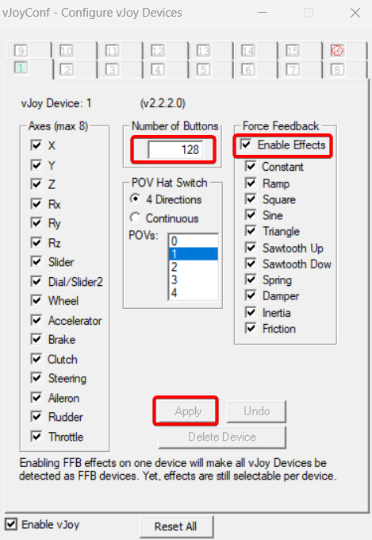
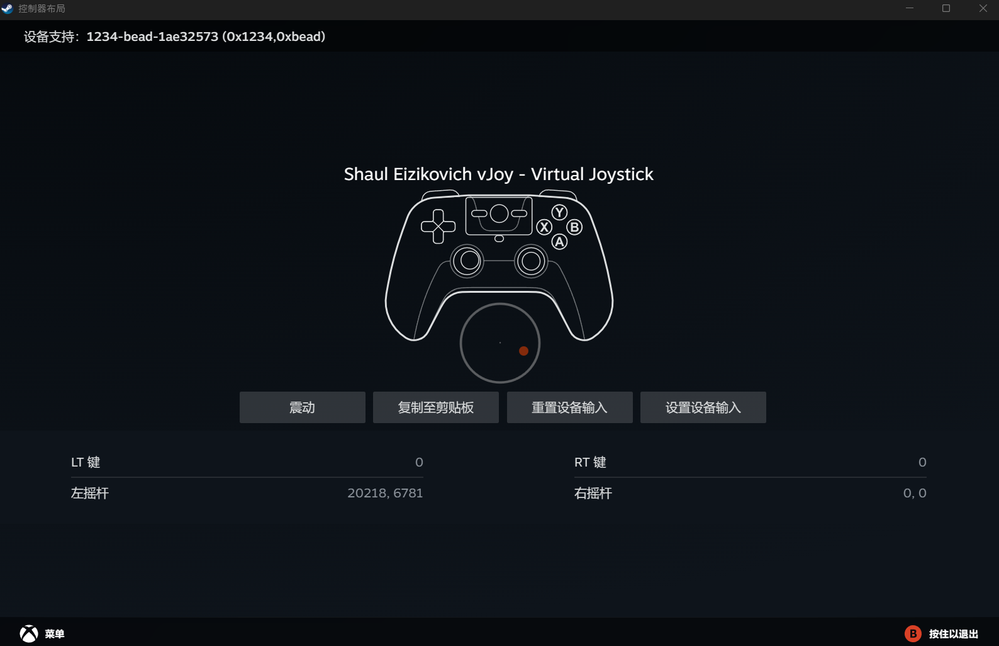

<h1 align="center">Mouse Steering Wheel 鼠标方向盘模拟</h1>
<p align="center">
    
</p>

<p align="center">
    <a href="https://github.com/Siriusq/MouseSteeringWheel"></a>
    
        
    
    
    
</p>

Mouse Steering Wheel 是一个 vJoy Feeder 程序，它能够将鼠标的移动事件传递到 [vJoy(virtual joystick)](https://github.com/shauleiz/vJoy)，然后由 vJoy 将输入的信号转换为模拟手柄的输出，实现用鼠标模拟方向盘或手柄摇杆的功能。

程序基于 WPF 框架，使用 C# 开发，仅支持 64 位 Windows 系统，Windows 10 1903 以下版本的系统需要单独安装 [.NET Framework 4.8](https://dotnet.microsoft.com/en-us/download/dotnet-framework/net48) 后才能运行程序。

# 特性
- 支持 vJoy 设备切换
- 最高支持 128 个 vJoy 按钮，可以为每个按钮分配自定义快捷键
- 内置两套 UI 主题：方向盘模拟和摇杆模拟，选择使用摇杆风格时，UI 在屏幕竖向的位置可调节
- 支持 UI 缩放
- 支持单独开启和设置 X轴 / Y轴摇杆模拟
- 支持摇杆敏感度调整
- 支持设置非线性摇杆
- 支持设置摇杆死区范围
- 支持使用快捷键重置摇杆和鼠标位置
- 支持使用快捷键暂停输入
- 支持英文、简体中文和繁体中文语言切换

<div align=center>
    
</div>

# 如何使用
## 安装并配置 vJoy
1. 下载并安装 [vJoy 2.2.2.0 版本](https://github.com/BrunnerInnovation/vJoy)。
2. 打开 Configure vJoy 程序。
3. 将 Number of Buttons 设置为 128。
4. 建议开启 Force Feedback Effects。
5. 点击 Apply 应用更改。

## 注意事项
1. 下载后直接双击运行 MouseSteeringWheel.exe，无需安装。
2. 按下 S 键来打开设置窗口。
3. 鼠标停留在设置项前的文本上时，会显示对应选项的说明。
4. 通用设置中所做的更改需要保存设置并重启程序后生效。
5. 设置自定义快捷键的方法：
   1. 鼠标左键单击对应输入框。
   2. 直接按下要使用的快捷键组合，输入框中会实时显示按下的按键。
   3. 所有按键都抬起后，会自动暂存自定义的快捷键。
6. 如果设置的快捷键不包含 Shift、Control 等修饰按键，仅使用单个普通按键时（如单独的 S 键），在其他程序中按下 S 键将不会有输出，输入法也不会响应，程序退出后恢复正常使用。这是因为程序使用 USER32 API 来注册全局快捷键，一旦设置成功，则相应按键的输入会被重定向到对应的功能，而程序退出时会注销全局快捷键，键盘输入就会恢复正常。
7. 部分游戏会交替响应键鼠输入和手柄输入，而且游戏设置中也没有关闭键鼠输入的选项，例如地平线4。此类游戏无法使用 Mouse Steering Wheel，因为鼠标一旦移动，游戏就会将输入切换到键鼠控制，vJoy 模拟摇杆的输入就会被打断。但是 Mouse Steering Wheel 又会将鼠标的移动映射到 vJoy，vJoy 模拟的摇杆输入又会让游戏切换到手柄控制。接下来就是无限循环，最终导致输入时断时续，无法正常使用。

## 配置 Steam 控制器
vJoy 模拟的手柄可以被映射为 Steam 支持的控制器，设置步骤如下：
1. 点击左上角的 Steam 展开下来菜单。
2. 打开设置 - 控制器。
3. 启动 Mouse Steering Wheel。
4. 将预先设置的快捷键映射到 Steam 控制器布局中。
5. 在库中右键单击打开游戏属性，在控制器设置中启用 Steam 输入。
6. 更多进阶设置请自行搜索。

<div align=center>
    
</div>

# 开发
如果你想基于此程序继续开发，请打开 **FodyWeavers.xml** ，注释掉 **Costura** 相关代码，因为项目中使用了 **Fody.Costura** 来将程序打包为单个的 exe，打包时 dll 等文件会嵌入 exe 中，导致 VS 因找不到需要的文件而报错。

例如某个需要的dll路径为`./bin/Release/xxx.dll`，Fody.Costura 会将这个文件嵌入 exe 中，`./bin/Release`目录下将不会存在`xxx.dll`，而VS仍然会按照先前的路径来寻找dll，导致出错。

```xml
<?xml version="1.0" encoding="utf-8"?>
<Weavers xmlns:xsi="http://www.w3.org/2001/XMLSchema-instance" xsi:noNamespaceSchemaLocation="FodyWeavers.xsd">
  <!--<Costura />-->
</Weavers>
```

# 第三方资源
## NuGet Package
Mouse Steering Wheel 使用了以下两个 NuGet 包来将所有资源打包嵌入到一个单独的 exe 文件中。
- [Costura](https://github.com/Fody/Costura) 
- [Resource.Embedder](https://www.nuget.org/packages/Resource.Embedder/)

## Icon
Mouse Steering Wheel 的图标使用了以下两个素材。
- [由 Uniconlabs 创造的鼠标图标 - 来自 Flaticon](https://www.flaticon.com/free-icon/mouse_6713690?term=mouse&page=1&position=38&origin=style&related_id=6713690)
- [由 muhammad atho' 创造的方向盘图标 - 来自 Flaticon](https://www.flaticon.com/free-icon/steering-wheel_8217198?term=steering&page=1&position=1&origin=style&related_id=8217198)